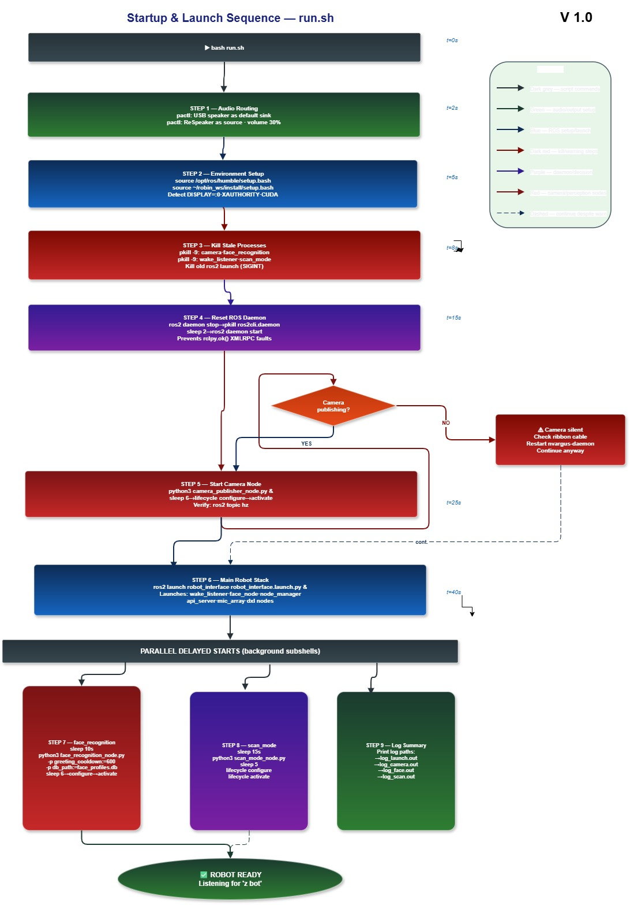

# 🤖 Robin Robot — System Architecture & Technical Reference

<div align="center">


*Complete engineering reference — nodes, data flow, voice pipeline, face recognition, vision AI*

</div>

---

## 📋 Contents

- [Hardware Specs](#-hardware-specs)
- [Master Architecture](#-master-architecture)
- [ROS2 Nodes](#-ros2-nodes--topics)
- [Voice Command Flow](#-voice-command-flow)
- [Face Recognition Pipeline](#-face-recognition-pipeline)
- [Scan Mode Flow](#-scan-mode--vision-api-flow)
- [Startup Sequence](#-startup--launch-sequence)
- [Diagrams](#-diagrams)
- [Quick Start](#-quick-start)

---

## 🔧 Hardware Specs

| Component | Details |
|-----------|---------|
| **Computer** | NVIDIA Jetson Orin NX · JetPack 36.4.7 |
| **OS** | Ubuntu 22.04 |
| **Middleware** | ROS2 Humble |
| **Camera** | CSI IMX sensor · GStreamer nvarguscamerasrc · 21 Hz |
| **Microphone** | SEEED ReSpeaker 4-Mic Array (UAC 1.0) |
| **Speaker** | USB Audio (Solid State Audio Device) |
| **Joint Motors** | Dynamixel Servos — head, arms |
| **Wheel Motors** | DDSM400 — UART serial |
| **Wake Word** | OpenWakeWord — `Zee_Bot.onnx` (offline) |
| **STT** | Vosk — `vosk-en` (offline, no internet) |
| **TTS** | Piper CUDA — `en_US-lessac-medium.onnx` (offline) |
| **LLM** | Zenon AIHIVE-LLMDSTXT (cloud) |
| **Vision AI** | Zenon AIHIVE-LLMFILTXT (cloud) |
| **Object Detection** | YOLOv8s TensorRT engine |
| **Face Recognition** | dlib HOG + CNN · 128-float embeddings · SQLite |
| **Robot IP** | `10.255.254.75` · API Port `8000` |

---

## 🏗️ Master Architecture

> Full system — 5 layers from hardware to Flutter app, all ROS2 nodes and connections


### Layer Summary

| Layer | What's Here |
|-------|-------------|
| **Output / Control** | motion_library · follower_ctrl · face_node (PyQt5) · api_server · Piper TTS |
| **Decision** | wake_listener_node ★ · intent_router · ai_chatbot LLM · Zenon Vision · node_manager |
| **Perception** | face_recognition_node · yolo_detector · object_tracker · scan_mode_node |
| **Driver / Publisher** | camera_publisher · microphone_array · dxl_wrapper · wheel_wrapper · Piper TTS driver |
| **Hardware** | CSI Camera · ReSpeaker · USB Speaker · Dynamixel Servos · DDSM400 Wheels · Jetson |

---

## 🔌 ROS2 Nodes & Topics

### Key Nodes

| Node | Type | Role |
|------|------|------|
| `wake_listener_node` | LifecycleNode | ★ Central hub — OWW + Vosk STT + intent routing + dispatch |
| `camera_publisher_node` | LifecycleNode | GStreamer CSI → `/camera/image/raw` 21 Hz BEST_EFFORT |
| `face_recognition_node` | LifecycleNode | HOG→CNN detection · SQLite DB · greet/enroll |
| `scan_mode_node` | LifecycleNode | Vision API scanning — OCR · ID · describe |
| `yolo_detector` | LifecycleNode | YOLOv8 TensorRT — detection_text + detection_raw |
| `object_tracker_node` | LifecycleNode | YOLO bbox → normalized error → `/tracker/target` |
| `follower_ctrl_node` | LifecycleNode | PID wheel control for person-following |
| `microphone_array_publisher` | LifecycleNode | ReSpeaker DOA → `/microphone_array/direction` |
| `face_node` | Node | PyQt5 SVG face animation — sub `/robot_face/expression` |
| `node_manager` | Node | Service: start/stop yolo + follow_obj on demand |

### Key Topics

| Topic | Type | Purpose |
|-------|------|---------|
| `/camera/image/raw` | `sensor_msgs/Image` | Camera feed · 21 Hz · BEST_EFFORT |
| `/face/detection` | `std_msgs/String` JSON | Live face detections (every cycle) |
| `/face/last_known` | `std_msgs/String` JSON | Last recognized person (persistent) |
| `/robot/run_scenario` | `std_msgs/String` | Trigger motion scenario |
| `/robot_face/expression` | `std_msgs/String` | Face animation state |
| `/scan/trigger` | `std_msgs/String` | One-shot scan: auto · ocr · id · scene |
| `/scan/mode` | `std_msgs/String` | Continuous scan on/off |
| `/scan/result` | `std_msgs/String` JSON | Vision API result |
| `/tracker/target` | `geometry_msgs/Vector3` | Normalized tracking error |
| `/ddsm400/cmd_speed` | `DDSM400CmdSpeed` | Wheel RPM command |
| `/robot/voice_inject` | `std_msgs/String` | Inject voice command (testing, no mic) |

---

## 🎤 Voice Command Flow

> Microphone → OpenWakeWord → Vosk STT → intent_router → action dispatch → Piper TTS

**States:**
```
IDLE ──(OWW score > 0.5)──► RECORDING ──(silence 0.8s)──► EXECUTING ──► IDLE
                                                               │
                                                    ──(follow_me)──► TRACKING
```

**Pre-router intercepts** (never reach LLM):

| Intent | Trigger | Handler |
|--------|---------|---------|
| `checkface` | "checkface", "identify" | Local face DB → TTS |
| `scan_now` | "scan now", "read text", "scan id" | `/scan/trigger` |
| `scan_mode_on/off` | "scan mode on/off" | `/scan/mode` |

**All voice commands:**

```
Movement:   go forward · go back · turn left · turn right · spin · stop · face me · face back
Gestures:   wave · dance · charge
Vision:     scan now · read text · scan id · describe scene · detect objects · scan mode on/off
Identity:   checkface · identify · follow me · stop following
System:     deactivate
Questions:  anything → routed to Zenon LLM (≤30 word reply)
```

> **Test without mic:**
> ```bash
> ros2 topic pub --once /robot/voice_inject std_msgs/msg/String 'data: "scan now"'
> ```

---

## 👤 Face Recognition Pipeline

> HOG pre-scan → CNN full-resolution → 128-float embeddings → SQLite L2 match

**Detection stages:**
1. **HOG pre-scan** at 0.5× scale — fast CPU filter, skip if no faces
2. **CNN full-resolution** — `face_locations(model='cnn', upsample=1)` — GPU
3. **Embeddings** — `face_encodings()` → 128-float vector per face
4. **DB match** — L2 distance vs all stored embeddings, threshold `0.60`
5. **Known** → greet via Piper TTS (600s cooldown)
6. **Unknown** → ask consent → capture name via Vosk → save to SQLite

**Key parameters:**

| Parameter | Value |
|-----------|-------|
| Match threshold | `0.60` (L2 distance) |
| Greeting cooldown | `600s` (10 minutes) |
| Ignore timer (unknown) | `300s` |
| Detect interval | `1.0s` |
| DB path | `/home/robin/robin_ws/face_profiles.db` |

**Enroll a person:**
```bash
cd /home/robin/robin_ws/src/robot_interface/robot_interface
python3 face_enroll.py --name "Kiran" --role owner --capture --samples 10
python3 face_enroll.py --list
```

---

## 🔍 Scan Mode — Vision API Flow

> Camera frame → face context injection → Zenon API → clean result → Piper TTS


**Scan types:**

| Mode | Voice Trigger | What Robin Says |
|------|--------------|-----------------|
| `auto` | "scan now" | 1-sentence description |
| `ocr` | "read text" | Every word of visible text |
| `id` | "scan id" | Name · DOB · ID# · Expiry |
| `scene` | "describe scene" | 2-sentence scene detail |
| `objects` | "detect objects" | List of all visible objects |

**Face-aware scanning:**
```
No known face:    "I see a person holding a paper"
Known face:       "I see Robin holding a paper"   ← name injected into Zenon API prompt
```
- Only uses live `/face/detection` data (age < 5s) — never stale DB

**API flow:**
```
POST /CreateRequest  → {value: 'uuid'}
  ↓ poll 1.0s
GET /GetRequestByRequestId  → status 0/1=InProgress · 2=Done · 3=Fail
  ↓ extract
processedContent → result → strip markdown → inject name → Piper TTS
```

---

## 🚀 Startup & Launch Sequence



```bash
bash /home/robin/robin_ws/run.sh
```

| Step | What Happens | Time |
|------|-------------|------|
| 1 | Audio routing — USB speaker + ReSpeaker source | t=0s |
| 2 | ROS2 environment source + CUDA vars + DISPLAY | t=2s |
| 3 | Kill stale processes (camera · face · wake · scan) | t=5s |
| 4 | Reset ROS daemon — prevents rclpy.ok() faults | t=8s |
| 5 | Start camera_publisher_node → lifecycle activate | t=15s |
| 6 | ros2 launch robot_interface → all main nodes | t=25s |
| 7 | face_recognition_node — delayed 10s | t=40s |
| 8 | scan_mode_node — delayed 15s | t=40s |

**Auto-start on boot:**
```bash
crontab -e
# Add:
@reboot sleep 15 && bash /home/robin/robin_ws/run.sh >> /home/robin/robot-zbot/data/log_launch.out 2>&1
```

**Useful debug commands:**
```bash
# Check all nodes are running
ros2 node list

# Verify camera publishing
ros2 topic hz /camera/image/raw

# Watch face recognition live
tail -f /home/robin/robot-zbot/data/log_face.out

# Check API is up
curl http://10.255.254.75:8000/robot/state
```

---

## 📊 Diagrams

All `.drawio` files are in the `diagrams/` folder. Open at **[app.diagrams.net](https://app.diagrams.net)** → File → Open from GitHub.

| File | Preview | Description |
|------|---------|-------------|
| `Master_architecture_v1.drawio` | [↑ see above](#-master-architecture) | Full 5-layer system architecture |
| `Scan_mode_flow.drawio` | [↑ see above](#-scan-mode--vision-api-flow) | Vision API pipeline |
| `Startup_sequence.drawio` | [↑ see above](#-startup--launch-sequence) | run.sh launch sequence |
| `Voice_command_flow.drawio` | — | Mic → OWW → Vosk → intent → TTS |
| `Face_recognition_pipeline.drawio` | — | HOG→CNN→DB→greet/enroll |
| `Object_following_flow.drawio` | — | YOLO→tracker→follower→wheels |
| `09_app_architecture.drawio` | — | Flutter app → HTTP → ROS2 → Hardware |

---

## 📦 Dependencies

```bash
# Python
pip install face_recognition aiohttp vosk sounddevice webrtcvad \
            openwakeword piper-tts ultralytics opencv-python \
            fastapi uvicorn PyQt5 --break-system-packages

# ROS2
sudo apt install ros-humble-cv-bridge ros-humble-sensor-msgs \
                 ros-humble-lifecycle-msgs ros-humble-geometry-msgs
```

---

## 🐛 Troubleshooting

| Problem | Cause | Fix |
|---------|-------|-----|
| No robot data in app | API not running | `bash run.sh` on robot |
| Camera not publishing | nvargus-daemon crashed | `sudo systemctl restart nvargus-daemon` |
| Wake word not heard | Gain too low | Check ReSpeaker is ON |
| Scan returns "failed" | No internet | `ping 8.8.8.8` on robot |
| Always says "Robin" for anyone | Stale DB used | Only live `/face/detection` (< 5s) is used — already fixed |
| "rclpy shutdown already called" | Double shutdown | Fixed in latest `camera_publisher_node.py` |

---

<div align="center">
<a href="../README.md">← Back to root</a> · <a href="../app/README.md">App User Manual →</a>
</div>
